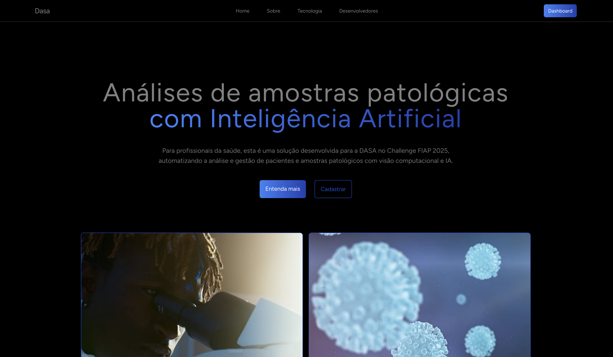

# DASA - Sistema de Monitoramento de Amostras Patológicas



Esta é uma plataforma desenvolvida para profissionais da saúde, que automatiza a análise de amostras patológicas utilizando visão computacional e inteligência artificial Gemini. O sistema permite a gestão de pacientes, análise automatizada e geração de relatórios de forma eficiente e segura.

---

## Tecnologias Utilizadas

- **Frontend:** React, Tailwind CSS, Bootstrap Icons, Inertia.js  
- **Backend:** PHP, Laravel  
- **Visão Computacional:** Python + OpenCV  
- **Integração com IA:** Gemini API  
- **Banco de Dados:** MySQL

---

## Pré-requisitos

Antes de iniciar, certifique-se de ter instalado:

- [PHP >= 8.0](https://www.php.net/manual/pt_BR/install.php)
- [Composer](https://getcomposer.org/)
- [Node.js e npm](https://nodejs.org/)
- [Python >= 3.8](https://www.python.org/downloads/)
- Banco de Dados configurado com suas credenciais

---

## Instalação e Execução

**1. Clone o repositório e instale as dependências:**

```
git clone https://github.com/seu-usuario/dasa.git
cd dasa
npm install
composer install
```

**2. Configure o ambiente:**

```
cp .env.example .env
php artisan key:generate
```

*Edite o arquivo `.env` com as credenciais do seu banco de dados e a chave da API Gemini.*

**3. Execute a aplicação:**

```
npm run dev
php artisan serve
```

**4. Ambiente Python (Opcional):**

*Se for utilizar os recursos de visão computacional, crie um ambiente virtual e instale as dependências:* 

```
python -m venv .venv
source .venv/bin/activate # Linux/macOS
.venv\Scripts\activate # Windows
pip install opencv-python numpy pymysql python-dotenv google-generativeai
```

## Funcionalidades

*   **Cadastro e Gestão de Pacientes:** Gerenciamento completo de informações de pacientes.
*   **Integração com Microscópios Digitais:** Conexão via USB para captura de imagens.
*   **Análises Automatizadas com IA:** Utilização de inteligência artificial para análise de amostras patológicas.
*   **Dashboard Responsivo:** Visualização de dados com gráficos e relatórios em um painel adaptável.
*   **Segurança e Autenticação:** Sistema robusto de segurança e autenticação de usuários.

## Desenvolvedores

*   **Gustavo Henrique:** [GitHub](https://github.com/GustavoHenrique) | [LinkedIn](https://www.linkedin.com/in/gustavohenrique)
*   **Steffany Medeiros:** [GitHub](https://github.com/SteffanyMedeiros) | [LinkedIn](https://www.linkedin.com/in/steffanymedeiros)
*   **Milena Garcia:** [GitHub](https://github.com/MilenaGarcia) | [LinkedIn](https://www.linkedin.com/in/milenagarcia)


